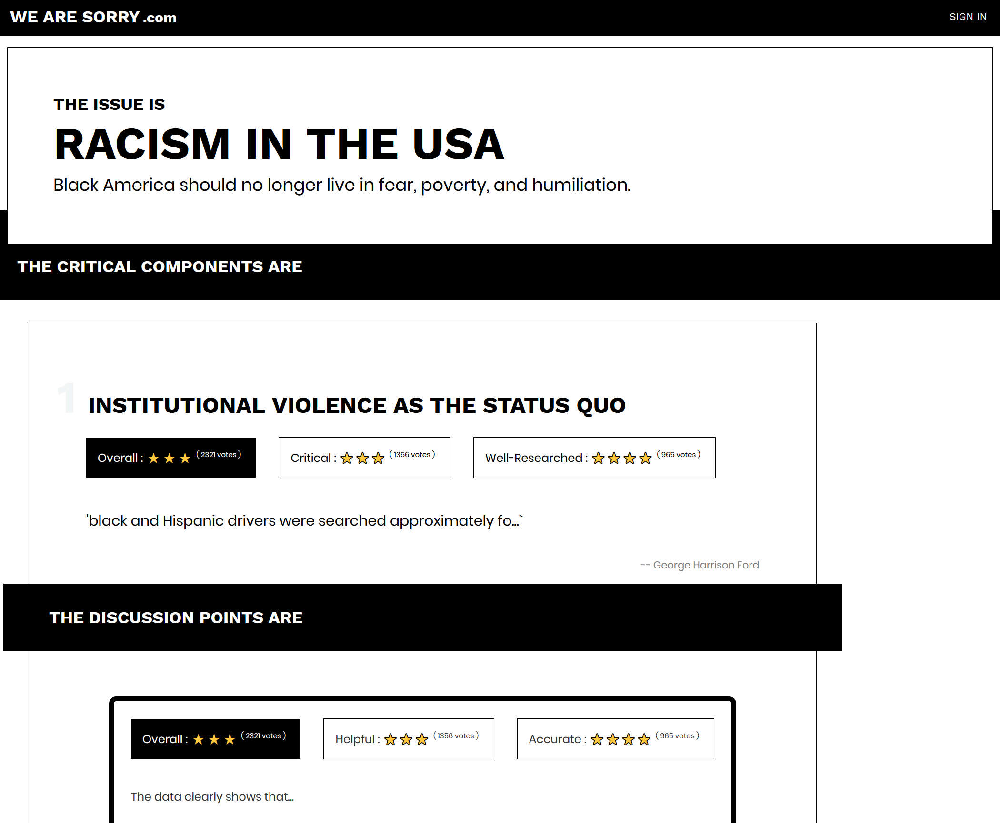

# we-are-sorry.com

> A tiny social app for electing solutions for the racism problem in the USA



View the current testing site @ [https://we-are-sorry-com.now.sh/](https://we-are-sorry-com.now.sh/)

## Disclaimer

This is called 'we-are-sorry.com' because I, [Robby Shaw](https://github.com/robbynshaw) am a white American, and I am sorry, and I know that is not enough. This app is not supposed to be just for white people to use, but I do hope that it can serve as a very small, inadequate apology _from_ some white people, and I hope that others may appropriate the name in their own way.

## Background

We appear to be in desperate need of a platform for massive social collaboration. Current major activism platforms include **change.org**, **gofundme.com**, **kickstarter.com**, etc. The one major missing feature in all of these systems is collaboration; i.e. there is _contribution_ towards a solution but not _collaboration_ toward a proposed solution.

> [Campaign Zero](https://www.joincampaignzero.org/) is another app on the scene with a very similar design/strategy. However, _Campaign Zero_ is limited in scope to police brutality, which is only part of the greater issue. In fact, _Campaign Zero_ could and probably should be proposed as a 'proposed solution' for a 'critical component' as shown below.

For issues as critical and urgent as the current racism crisis in America, solutions incubated by individuals or small groups of people are unlikely to be comprehensive or acceptable for large groups of the effected population. This is as true for ground up solutions as it is for top down political solutions. A few people in a room hardly constitutes an adequate representation of the collective intelligence of a populace.

Instead, we should attempt to **build a system in which the majority of people can collaborate toward and commit upon a solution**, utilizing principles of [critical mass](<https://en.wikipedia.org/wiki/Critical_mass_(sociodynamics)>) and positive social pressure.

We are uniquely situated in history to create novel platforms for massive, social collaboration. We should make the most of that opportunity to further the cause of a free and just humanity. _Any attempt will be a long shot, but we should at least try to help._

## Design Overview

- Visit home page (we-are-sorry.com)
  - When the user clicks on any 'action', they are prompted to login
- User sees _issue_ detailed at the top of the page
  - 'Racism in America is not going away...'
- User sees hightest rated _critical components_ underneath
  - e.g. economic disparity, prison population disparity, policing oversight, etc.
  - each component is a record submitted by a user with a title and description
  - user can add a component
  - user can vote on a component
- For each \*critical component, user see's a list of the highest rated proposed solutions
  - e.g. hunger strike, protest, petition
  - each solution is a record submitted by a user with a title, description, commitment types, and critical mass amount for each commitment type
  - user can add a proposed solution
  - user can vote on a solution
  - user can commit to a commitment type
    - user is notified when commitments reach critical mass
- For both _critical components_ and _proposed solutions_, users may add a 'discussion point'
  - Essentially a comment, but should be more in-depth
    - Ideally including data and sources
  - Users can vote on discussion points
    - Discussion points are displayed by highest rated
  - Discussion points can be nested

### The Tricky/Critical Part

- Users need to be vetted somehow
  - That somehow needs to be as non-discriminatory as possible
    - Phone number, etc.
- Users should be limited to a certain number of submissions, votes, commitments, and discussions
  - This will help prevent careless actions and make it feel more important
- Commitments need backing
  - e.g. social pressure through friend network, transparency, etc.

## Concerns

- Rating system may not be enough to self-moderate the hateful and spammy submissions

## Architecture

> Goal is to build this _hack-a-thon_ style, as quickly as possible

- AspNetCore for Backend API
- NextJS or React for FrontEnd

## Collaboration

- [wearesorrydotcom.slack.com](https://wearesorrydotcom.slack.com)
  - [invite link](https://join.slack.com/t/wearesorrydotcom/shared_invite/zt-evxer2n8-IKlr_7~Eji~QUlUxS~do1Q)
- [github issues](https://github.com/robbynshaw/we-are-sorry.com/issues)

## Getting Started

First, run the development server:

```bash
npm run dev
# or
yarn dev
```

Open [http://localhost:3000](http://localhost:3000) with your browser to see the result.

You can start editing the page by modifying `pages/index.js`. The page auto-updates as you edit the file.
